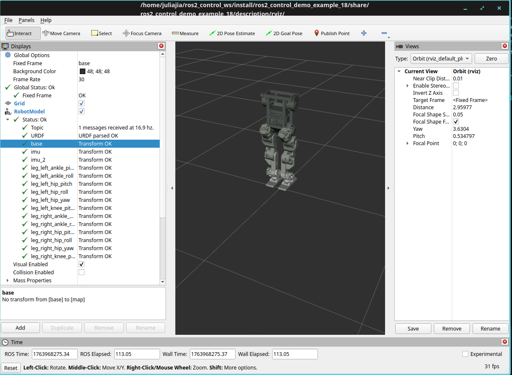

ros2_control_demo_example_18
================================

This demo runs a policy driven 
`(Open Duck Mini v2) <https://github.com/apirrone/Open_Duck_Mini/tree/v2/mini_bdx/robots/open_duck_mini_v2 >`_
in Mujoco and streams observations via ``interfaces_state_broadcaster``.

Setup
-----

Prerequisites
~~~~~~~~~~~~~

.. code-block:: bash

   # ONNX Runtime
   wget https://github.com/microsoft/onnxruntime/releases/download/v1.23.2/onnxruntime-linux-x64-1.23.2.tgz
   tar -xzf onnxruntime-linux-x64-1.23.2.tgz
   sudo cp -r onnxruntime-linux-x64-1.23.2/include/* /usr/local/include/
   sudo cp -r onnxruntime-linux-x64-1.23.2/lib/* /usr/local/lib/
   sudo ldconfig

   # Gazebo (gz-sim Harmonic or newer recommended)
   sudo apt-get update
   sudo apt-get install ros-${ROS_DISTRO}-ros-gz

- Place the trained policy at ``onnx_model/policy_biped_25hz_a.onnx``.
- Source your ROS 2 workspace before running any commands below.

Troubleshooting ONNX Runtime installation
~~~~~~~~~~~~~~~~~~~~~~~~~~~~~~~~~~~~~~~~~~

If you encounter the following error:

.. code-block:: bash

   # find where the library is extracted
   find ~ -name "onnxruntime-linux-x64-*" -type d 2>/dev/null

   # copy to the right location
   sudo cp -r /pathto_extracted_library/onnxruntime-linux-x64-1.23.2/include/* /usr/local/include/
   sudo cp -r /pathto_extracted_library/onnxruntime-linux-x64-1.23.2/lib/* /usr/local/lib/
   sudo ldconfig

   # Check library
   ls -l /usr/local/lib/libonnxruntime.so*

   # If not in /usr/local, check where you extracted
   ls -l ~/onnxruntime-linux-x64-*/lib/
   ls -l ~/onnxruntime-linux-x64-*/include/

   ls -l /usr/local/lib/libonnxruntime.so*
   ls -l /usr/local/include/onnxruntime/

   # check header files
   ls -l /usr/local/include/onnxruntime_cxx_api.h

Docker Setup (TODO(juliaj): update this section)
~~~~~~~~~~~~

Build the Docker image with optional source directory argument:

.. code-block:: bash

   # Build with default source directory
   docker build --build-arg ROS_DISTRO=rolling -f Dockerfile/Dockerfile_onnx -t ros2_control_demo_example_18 .

   # Build with custom source directory path
   docker build --build-arg ROS_DISTRO=rolling --build-arg SOURCE_DIR=/custom/path -f Dockerfile/Dockerfile_onnx -t ros2_control_demo_example_18 .

Run the container with volume mount:

.. code-block:: bash

   # Mount the source directory to enable live code changes
   docker run -it --rm \
     -v /path/to/ros2_control_demos:/home/ros2_ws/src/ros2_control_demos \
     --network host \
     ros2_control_demo_example_18

   # Or use the SOURCE_DIR environment variable from build
   docker run -it --rm \
     -v /path/to/ros2_control_demos:${SOURCE_DIR} \
     --network host \
     ros2_control_demo_example_18

The volume mount allows you to modify code on the host and see changes without rebuilding the image.

Compile the demo
-----------------
1. Build mujoco_ros2_simulation, follow the instruction from https://github.com/ros-controls/mujoco_ros2_simulation
2. From your ROS 2 workspace,

   .. code-block:: bash

      # source the mujoco_ros2_simulation setup.bash
      source /update_me/mujoco_ros2_simulation/install/setup.bash

      # build the example_18 from project root
      colcon build --symlink-install --packages-select ros2_control_demo_example_18

Run the demo
------------

1. Set up Mujoco simulation shell environment, follow the instruction from https://github.com/ros-controls/mujoco_ros2_simulation

   .. code-block:: bash

      # from the folder you have mujoco_ros2_simulation git repo
      pixi shell

      # install the mujoco_ros2_simulation
      source install/setup.bash

2. Start Open Duck Mini in Mujoco

   .. code-block:: bash

      # make sure you run pixi shell from mujoco_ros2_simulation
      # cd to ros2_ws 

      ${MUJOCO_DIR}/bin/simulate src/ros-controls/ros2_control_demos/example_18/description/mujoco/scene.xml

3. Bring up controllers

   .. code-block:: bash

      # visual check
      ros2 launch ros2_control_demo_example_18 view_robot.launch.py gui:=true
      
      ros2 launch ros2_control_demo_example_18 example_18_mujoco.launch.py

      # Check controllers
      ros2 control list_controllers

3. Command and observe

   .. code-block:: bash

      # Walk forward scenario: Drive forward for 2 seconds at 0.4 m/s
      # This script publishes velocity commands at 10 Hz for the specified duration
      python3 $(ros2 pkg prefix ros2_control_demo_example_18)/share/ros2_control_demo_example_18/launch/test_motions.py

Testing
-------

Unit tests
~~~~~~~~~~

.. code-block:: bash

   cd ~/ros2_control_ws
   colcon build --packages-select ros2_control_demo_example_18 --cmake-args -DBUILD_TESTING=ON
   source install/setup.bash
   colcon test --packages-select ros2_control_demo_example_18 --event-handlers console_direct+

End-to-end validation
~~~~~~~~~~~~~~~~~~~~~

After the launch sequence above:

- Monitor ``/interfaces_state_broadcaster/values`` and ``/imu_sensor_broadcaster_1/imu`` to confirm sensor flow.
- Check ``ros2 topic echo /joint_states`` to ensure the forward position controller reflects ONNX outputs.
- Try alternative ``cmd_vel`` inputs (turning, reverse) to ensure stability.
- Review the controller logs at ``--log-level debug`` if the observation vector size mismatches the ONNX model.

Architecture
------------

.. code-block:: text

   [Gazebo Simulator]
       ↓ (joint states, IMU data)
   [Hardware Interface]
       ↓ (state interfaces)
   [Interfaces State Broadcaster]
       ↓ (ROS2 topic: /interfaces_state_broadcaster/values)
   [Locomotion Controller]
       ↑ (ROS2 topic: /motion_controller/cmd_vel - velocity commands)
       ↓ (ONNX inference)
       ↓ (command interfaces - joint position commands)
   [Hardware Interface]
       ↓ (joint commands)
   [Gazebo Simulator]

Observation Vector Dimension
-----------------------------

The dimensions are determined by the source code and `IsaacLab MDP documentation <https://isaac-sim.github.io/IsaacLab/main/source/api/lab/isaaclab.envs.mdp.html>`_.

1. generated_commands (line 51-54):
   - Output: 4D when heading_command=True
   - From UniformVelocityCommandCfg: [lin_vel_x, lin_vel_y, ang_vel_z, heading]
   - Without heading: 3D [lin_vel_x, lin_vel_y, ang_vel_z]

   .. code-block:: python

      base_velocity = mdp.UniformVelocityCommandCfg(
          resampling_time_range=(10.0, 10.0),
          debug_vis=True,
          asset_name="robot",
          heading_command=True,
          heading_control_stiffness=0.5,
          rel_standing_envs=0.02,
          rel_heading_envs=1.0,
          ranges=mdp.UniformVelocityCommandCfg.Ranges(
              lin_vel_x=(-0.5, 0.5),
              lin_vel_y=(-0.25, 0.25),
              ang_vel_z=(-1.0, 1.0),
              heading=(-math.pi, math.pi),
          ),
      )

2. base_ang_vel (line 55-58):
   - Output: 3D
   - `mdp.base_ang_vel <https://isaac-sim.github.io/IsaacLab/main/source/api/lab/isaaclab.envs.mdp.html#isaaclab.envs.mdp.base_ang_vel>`_ returns torch.Tensor with shape (3,)
   - Returns base angular velocity in world frame: [ang_vel_x, ang_vel_y, ang_vel_z] (roll, pitch, yaw rates)

3. projected_gravity (line 59-62):
   - Output: 3D
   - `mdp.projected_gravity <https://isaac-sim.github.io/IsaacLab/main/source/api/lab/isaaclab.envs.mdp.html#isaaclab.envs.mdp.projected_gravity>`_ returns torch.Tensor with shape (3,)
   - Returns gravity vector projected into body frame: [g_x, g_y, g_z]

4. joint_pos_rel (line 63-67):
   - Output: N dimensions (one per joint in HUMANOID_LITE_LEG_JOINTS)
   - `mdp.joint_pos_rel <https://isaac-sim.github.io/IsaacLab/main/source/api/lab/isaaclab.envs.mdp.html#isaaclab.envs.mdp.joint_pos_rel>`_ returns torch.Tensor with shape (N,)

5. joint_vel_rel (line 68-72):
   - Output: N dimensions (one per joint in HUMANOID_LITE_LEG_JOINTS)
   - `mdp.joint_vel_rel <https://isaac-sim.github.io/IsaacLab/main/source/api/lab/isaaclab.envs.mdp.html#isaaclab.envs.mdp.joint_vel_rel>`_ returns torch.Tensor with shape (N,)

6. last_action (line 73):
   - Output: N dimensions (one per joint in HUMANOID_LITE_LEG_JOINTS)
   - `mdp.last_action <https://isaac-sim.github.io/IsaacLab/main/source/api/lab/isaaclab.envs.mdp.html#isaaclab.envs.mdp.last_action>`_ returns torch.Tensor with shape (N,)

Your ROS2 implementation matches these dimensions: 4 + 3 + 3 + N + N + N = 10 + 3N.

Debugging Dimension Mismatch Errors
-------------------------------------

If you encounter "Got invalid dimensions for input: obs" error:

1. Check ONNX model metadata: The controller prints detailed model information on startup:
   - Look for ``=== ONNX Model Input Metadata ===`` section
   - Shows input name, shape, and data type
   - Example: ``Input[0]: name='obs', shape=[1, 46], type=float32``
   - Also prints output metadata: ``=== ONNX Model Output Metadata ===``

2. Compare with config: The controller compares model expectations with ``env_cfg.py``:
   - Expected: ``10 + 3*N`` where N = number of joints
   - Shows breakdown: ``4 (velocity_commands) + 3 (base_ang_vel) + 3 (projected_gravity) + N (joint_pos) + N (joint_vel) + N (previous_action)``

3. Verify observation size: The controller validates observation size. Check logs for:
   - ``Observation size mismatch: got X, expected Y``
   - Component breakdown showing which part failed

4. Common issues:
   - Model input name: Check if model expects ``'obs'`` or different name (printed in metadata)
   - Previous action size: Ensure ``previous_action_`` is initialized with ``joint_names_.size()`` elements
   - Joint count mismatch: Verify number of joints matches model training (12 for biped)
   - Model shape: ONNX models may expect ``[1, 46]`` (with batch) or ``[46]`` (without batch)
   - Dynamic dimensions: Models with ``-1`` in input shape are handled automatically

5. Debug steps:
   - Check startup logs for complete model metadata (input/output names, shapes, types)
   - Enable debug logging: ``--log-level debug`` for runtime observation validation
   - Verify all sensor data is being received (IMU, joints)
   - Ensure default joint positions are initialized before first inference
   - Compare model's expected input shape with ``env_cfg.py`` observation configuration

For example, if there are 12 leg joints, the observation vector dimension will be 10 + 3*12 = 46.

Debugging Action Quality Issues
--------------------------------

If you encounter high clamping rates, unstable actions, or the robot falling, check the action quality metrics reported by the controller.

Action Quality Metrics
~~~~~~~~~~~~~~~~~~~~~~

The controller reports action quality statistics every 100 updates (~4 seconds at 25Hz):

- Clamping rate: Percentage of commands that exceed joint limits
- Action smoothness: Average change per step (rad/step)
- Extreme actions: Percentage of actions beyond ±3.0 rad
- Most clamped joints: Joints that frequently exceed limits
- Action ranges: Min/max values observed for each joint

Warning thresholds:
- Clamping rate > 20%: Actions frequently exceed limits
- Action change rate > 0.5 rad/step: Actions may be unstable
- Extreme action rate > 5%: Model may be producing invalid outputs

Common Issues and Solutions
~~~~~~~~~~~~~~~~~~~~~~~~~~~

.. note::
   Work in Progress: This documentation is still under development. The robot currently falls down immediately after receiving a command. This issue is being actively investigated and resolved.

1. High Clamping Rate (>60%)

   Symptoms:
   - Most joints clamped every update
   - Actions frequently exceed limits
   - Robot unable to execute desired motions

   Diagnostic steps:

   a. Check raw model outputs (enable debug logging):

      .. code-block:: bash

         ros2 launch ros2_control_demo_example_18 example_18_gazebo.launch.py log_level:=debug

      Look for "Raw model outputs (before scaling)" in logs. Expected range: typically [-1, 1] or [-4, 4].
      If outputs are >10, the model may be producing wrong values.

   b. Verify action scale:

      Check ``action_scale`` in ``biped_robot_controllers.yaml`` (default: 0.25).
      If raw outputs are large, try reducing scale:

      .. code-block:: yaml

         action_scale: 0.1  # Try 0.1 instead of 0.25

   c. Enable default joint positions:

      Uncomment and verify in config:

      .. code-block:: yaml

         default_joint_positions: [0.0, 0.0, -0.2, 0.4, -0.3, 0.0, 0.0, 0.0, -0.2, 0.4, -0.3, 0.0]

2. High Action Change Rate (>0.5 rad/step)

   Symptoms:
   - Actions jumping erratically between updates
   - Robot movements jerky or unstable
   - High "Action smoothness" values in quality report

   Solutions:

   a. Verify observation space matches training:
      - Check if sensor data (IMU, joint states) are in correct units/ranges
      - Verify observation normalization matches training configuration
      - Ensure default joint positions are initialized correctly

   b. Check model compatibility:
      - Verify ONNX model matches training configuration
      - Compare with Berkeley-Humanoid-Lite training configs
      - Ensure model was trained with same action scaling

3. Extreme Actions (>3.0 rad)

   Symptoms:
   - Actions beyond reasonable joint ranges
   - Model producing invalid outputs
   - High extreme action rate in quality report

   Solutions:

   a. Check observation formatter:
      - Verify observation dimensions match model input
      - Ensure sensor data is properly normalized
      - Check if IMU and joint state scaling is correct

   b. Verify model inputs:
      - Check "Observation size mismatch" errors in logs
      - Verify all sensor data is being received
      - Ensure ``previous_action_`` is properly initialized

4. Specific Joint Issues

   If specific joints are always clamped (e.g., all ankle joints):

   a. Check joint limits:
      - Verify limits in ``biped_robot_controllers.yaml`` match ros2_control config
      - Check for Gazebo limit enforcement issues (see below) -- this hasn't been observed in this demo at later stage

   b. Check action ranges:
      - Review "Action ranges" in quality report
      - Compare with expected joint ranges from training
      - Verify if model outputs are reasonable for that joint
